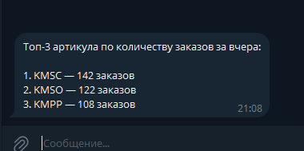

# Wildberries Orders ETL

Тестовое задание для автоматизации выгрузки заказов Wildberries и отправки уведомлений в Telegram.

## Функциональность

Скрипт выполняет следующие действия:

1. Получает заказы Wildberries за предыдущий день.
2. Преобразует данные в табличный формат.
3. Сохраняет результат в CSV-файл.
4. Формирует топ-3 артикула по количеству заказов.
5. Отправляет уведомление в Telegram.

---

## Структура проекта

```text
    app/
    ├── clients/
    │   ├── wildberries_client.py
    │   └── telegram_client.py
    │
    ├── config/
    │   └── settings.py
    │   └── logging.py    
    │
    ├── services/
    │   └── orders_service.py
    │
    ├── storage/
    │   └── csv_storage.py
    │
    ├── utils/
    │   └── dates.py
    │
    └── main.py
    
    data/
    logs/
    .env.example
    README.md
```

---

## Используемые технологии

* Python 3.12+
* pandas
* requests
* python-dotenv

---

## Установка

```bash
git clone https://github.com/simbarilion/Wb_orders_task

cd Wb_orders_task

poetry install

Активация окружения:

poetry shell

Опционально:

poetry run pre-commit install

```

---

## Переменные окружения

Создать файл `.env` (пример находится в .env.example):

```env
WB_TOKEN=your_wb_token
TG_TOKEN=telegram_bot_token
TG_CHAT_ID=telegram_chat_id
```

---

## Запуск

```bash
poetry run python -m app.main
```

После выполнения:

* CSV-файл будет сохранён в директории `data/`
* лог-файлы будут сохранены в директории `logs/`
* уведомление будет отправлено в Telegram

---

## Формат CSV

Сохраняются следующие поля:

| Поле         | Описание                 |
| ------------ | ------------------------ |
| order_date   | дата заказа (дд-мм-гггг) |
| article      | артикул продавца         |
| product_name | название товара          |
| status       | статус заказа            |
| price        | сумма заказа             |

---

## Формат Telegram-сообщения

Пример сообщения:

```text
Топ-3 артикула по количеству заказов за вчера

1. KMPP — 25 заказов
2. KMSO — 18 заказов
3. KMTC — 12 заказов
```

Скриншот Telegram-уведомления:



---

## Особенности реализации

- Для получения заказов используется Statistics API Wildberries.


- Параметр `flag=1` позволяет получить данные за конкретную дату, указанную в `dateFrom`.


- Для сохранения истории выгрузок используется генерация уникальных имён CSV-файлов с временной меткой запуска.
Такой подход исключает случайное перезаписывание предыдущих выгрузок и упрощает ведение истории данных.


- Эндпоинт /api/v1/supplier/orders не возвращает человекочитаемое название товара и статус заказа. 
Поэтому в рамках задания:

    - product_name формируется из комбинации brand + subject
    - status определяется на основе флага isCancel
  

- В проекте реализовано структурированное логирование в файл и консоль.

---

## Возможные улучшения

1. Реализовать retry-механику для запросов к Wildberries.
2. Добавлять в таблицу данные заказов через отдельный запрос к API карточек товаров
3. Добавить unit-тесты для бизнес-логики.
4. Настроить контейнеризацию через Docker.
5. Настроить запуск по расписанию (Airflow).
6. Перенести хранение данных в PostgreSQL.
7. Добавить алертинг при ошибках выполнения.

---

## Автор

Надежда Попова

Python Developer

nadezhdapopova13@yandex.ru

GitHub: simbarilion
